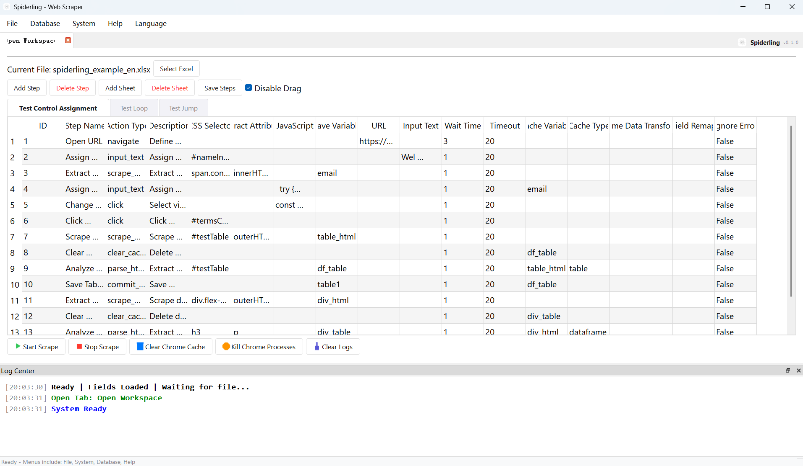

# Spiderling - Web Content Scraper

[简体中文](docs/README_zh.md) | [繁體中文](docs/README_tw.md) | [日本語](docs/README_ja.md) | [日本語 (和風)](docs/README_ja_trad.md) | [English](README.md)

Spiderling is a simple, efficient, and automated web content scraping tool built with Python and PyQt5. It provides a user-friendly graphical interface that allows users to define, manage, and execute complex scraper workflows without in-depth coding knowledge.



## 🚀 Features

- **Intuitive Workflow Management**: Define scraping tasks as a series of ordered steps (actions).
- **Rich Set of Actions**:
  - **Navigation**: Open URLs and navigate between web pages.
  - **Interactions**: Click elements, input text, and execute custom JavaScript.
  - **Data Extraction**: Parse web pages via CSS selectors, parse local HTML files, or extract information from specific URLs.
  - **Logic Control**: Supports loops (iterating through cache), jumping to specified steps, resetting the flow, etc.
  - **Delay & Wait**: Built-in waiting mechanisms to easily handle dynamically loaded content.
- **Customizable Data Transformation**:
  - **Percentage Conversion**: Convert percentage strings (e.g., "15%") to float (0.15).
  - **Thousand Separator Cleaning**: Remove thousand separators (commas) from numbers.
  - **Advanced**: Data transformation can be completed via DIY configuration files.
- **Multi-Database Support**: Seamlessly store scraped data to **SQLite, MySQL, PostgreSQL, SQL Server, or Oracle**.
- **Browser Management**: Integrated functionality to clear Chrome cache and force-close browser processes.
- **Multi-Language Support**: Built-in **Simplified Chinese, Traditional Chinese, English, and Japanese**.

## 📦 Installation Instructions

### Environmental Requirements
- Python 3.10+
- Google Chrome browser installed

### Installation Steps
1. **Clone the Repository**:
   ```bash
   git clone https://github.com/OahuTree/spiderling.git
   ```

2. **Install Dependencies**:
   ```bash
   pip install -r requirements.txt
   ```

3. **Start the Program**:
   ```bash
   python spiderling.py
   ```

## 📖 Usage Guide
1. **Browser Configuration**: If the program does not automatically recognize it, please specify the executable path of the Chrome browser in the settings.

2. **Database Settings**: Set the target database connection in the "Database Configuration" tab.
3. **Define Steps**:
   - Add a new worksheet.
   - Use the "Add Step" dialog to define scraping logic.
   - Select an action type (e.g., "Navigate to Page", "Click Control", "Web Parsing") and fill in the corresponding parameters (URL, CSS Selector, etc.).
   - You can refer to [spiderling_example_en.xlsx](docs/spiderling_example_en.xlsx)
4. **Data Transformation**: Apply data transformation rules using the "Stage Data" action before saving.
5. **Execute Task**: Click "Start Scrape" to launch the automated process. You can monitor progress in the "Log Center" at the bottom.
6. **Directory Permissions**: The program will create an 'oahutree_spiderling' folder in the current user's home directory. Please ensure the program has read and write permissions for this directory.


## ⚙️ Configuration File Description

- **Multi-Language**: Translation files are located in `config/locales/`.

---

**Spiderling** - Making automated data collection simple.
