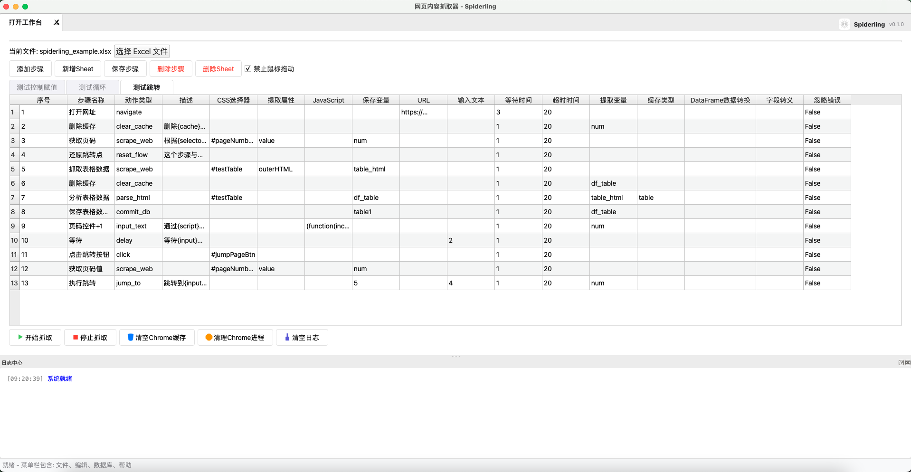
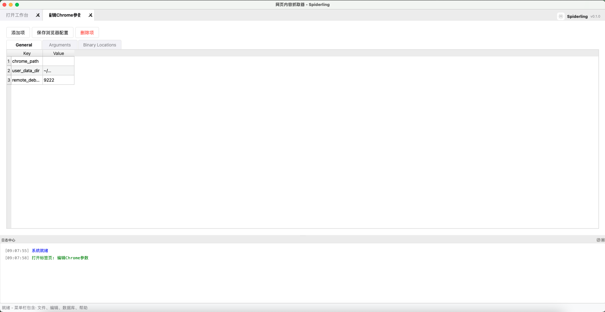

# Spiderling - 電脳情報収集機 (ウェブスクレイパー)

[简体中文](README_zh.md) | [繁體中文](README_tw.md) | [日本語](README_ja.md) | [日本語 (和風)](README_ja_trad.md) | [English](../README.md)

Spiderling（スパイダーリング）は、PythonとPyQt5を用いて誂えた、簡便かつ強力な自動情報収集器にございます。深遠なる電脳の知識を要さずとも、複雑な収集工程を定義・管理・執行できる、使い勝手の良い画面を提供いたす。



## 🚀 主な機能

- **直感的な工程管理**: 収集の任を一連の順序立てた手順（行動）として定義。
- **多彩なる行動集**:
  - **巡回**: URLを開き、網（ウェブ）のページ間を移動。
  - **操作**: 要素をクリック、文字を入力、あるいはJavaScriptを執行。
  - **抽出**: CSS選択器を用いてページを解析、あるいはお手元のHTMLや特定のURLより情報を抽出。
  - **制御**: 繰り返し（キャッシュ経由）、特定手順への移動、工程の初期化を支える。
  - **待機**: 動的コンテンツの読み込みを待つ仕掛けを内蔵。
- **誂え向きの変換機能**:
  - **百分率変換**: パーセントの文字（例: "15%"）を浮動小数点（0.15）へ変換。
  - **桁区切り除去**: 数値より千の位の区切り（カンマ）を除去。
  - **高度なる設定**: 設定ファイルを介してお好みの変換が可能。
- **多くの書庫（データベース）への対応**: 収集した情報を **SQLite, MySQL, PostgreSQL, SQL Server, Oracle** へ滞りなく保存。
- **閲覧機の管理**: Chromeの記録（キャッシュ）消去や、閲覧機の強制終了機能を備える。
- **言葉の切り替え**: **日本語、簡体字中国語、繁体字中国語、英語** に対応。

## 📦 導入の手引き

### 必要条件
- Python 3.10以上
- Google Chrome 閲覧機が導入されていること

### 導入手順
1. **写しの取得**:
   ```bash
   git clone https://github.com/OahuTree/spiderling.git
   ```

2. **依拠するものの導入**:
   ```bash
   pip install -r requirements.txt
   ```

3. **起動**:
   ```bash
   python spiderling.py
   ```

## 📖 使用の心得
1. **閲覧機の設定**: 自動で認識されぬ場合は、設定にてChromeの在り処（パス）を指定されたし。

2. **書庫（データベース）の設定**: 「データベース設定」タブにて保存先を設定されたし。
3. **手順の定義**:
   - 新しき紙面（シート）を追加。
   - 「手順追加」にて収集の理（ロジック）を定義。
   - 行動の種類を選び、必要な情報を入力されたし。
   - [spiderling_example.xlsx](spiderling_example.xlsx) が参考になろう。
4. **情報の変換**: 保存の前に「データ準備 (Stage Data)」にて変換の理を適用されたし。
5. **執行**: 「収集開始」を押し、自動化を起動。下部の「記録所」にて進捗を見守るべし。
6. **目録の読み書き権限**: 此の仕組みは現在のお使いの方（ユーザー）の目録に 'oahutree_spiderling' フォルダを拵えます。目録の読み書きが叶うよう、お計らい願いたく。


## ⚙️ 設定について

- **多言語**: 翻訳の品々は `config/locales/` にございます。

---

**Spiderling** - 自動なるデータ収集を、より身近に。
