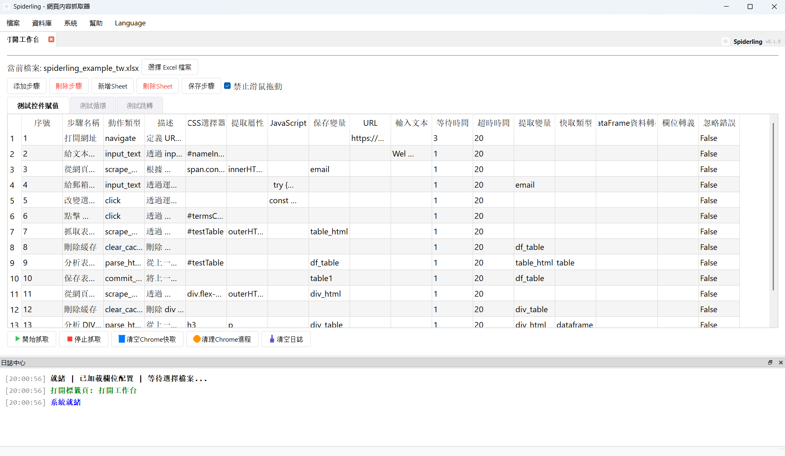

# Spiderling - 網頁內容採集器 (Web Scraper)

[简体中文](README_zh.md) | [繁體中文](README_tw.md) | [日本語](README_ja.md) | [日本語 (和風)](README_ja_trad.md) | [English](../README.md)


Spiderling 是一款基於 Python 和 PyQt5 構建的簡單、高效、自動化的網頁內容採集工具。它提供了一個友好的圖形介面，讓用戶無需深入的程式碼知識即可定義、管理和執行複雜的採集工作流。



## 🚀 功能特性

- **直觀的工作流管理**：將採集任務定義為一系列有序的步驟（動作）。
- **豐富的動作集合**：
  - **導航定位**：打開 URL，在網頁間跳轉。
  - **交互操作**：點擊元素、輸入文字、執行自定義 JavaScript。
  - **數據提取**：透過 CSS 選擇器解析網頁、解析本地 HTML 檔案或從特定 URL 提取信息。
  - **邏輯控制**：支持循環（透過緩存迭代）、跳轉至指定步驟、重置流程等。
  - **延時等待**：內置等待機制，輕鬆應對動態加載的內容。
- **可定制的數據轉換**：
  - **百分比轉換**：將百分比字串（如 "15%"）轉換為浮點數（0.15）。
  - **千分位清理**：取消數字中的千分位（逗號）分隔符。
  - **進階**：可以透過 DIY 配置文件完成數據轉換。
- **多數據庫支持**：可將採集的數據無縫存儲至 **SQLite、MySQL、PostgreSQL、SQL Server 或 Oracle**。
- **瀏覽器管理**：集成清除 Chrome 緩存和強制清理瀏覽器進程的功能。
- **多語言支持**：內置 **繁體中文、簡體中文、英語、日語**。

## 📦 安裝說明

### 環境要求
- Python 3.10+
- 已安裝 Google Chrome 瀏覽器

### 安裝步驟
1. **克隆倉庫**：
   ```bash
   git clone https://github.com/OahuTree/spiderling.git
   ```

2. **安裝依賴**：
   ```bash
   pip install -r requirements.txt
   ```

3. **啟動程式**：
   ```bash
   python spiderling.py
   ```

## 📖 使用指南
1. **瀏覽器配置**：如果程式未自動識別，請在設置中指定 Chrome 瀏覽器的執行路徑。

2. **數據庫設置**：在「數據庫配置」選項卡中設置目標數據庫連接。
3. **定義步驟**：
   - 新增工作表。
   - 使用「添加步驟」對話框定義採集邏輯。
   - 選擇動作類型（如「定位網頁」、「點擊元件」、「網頁解析」），並填寫相應參數（URL、CSS 選擇器等）。
   - 可以參考 [spiderling_example_tw.xlsx](spiderling_example_tw.xlsx)
4. **數據轉換**：在保存前使用「準備數據 (Stage Data)」動作應用數據轉換規則。
5. **執行任務**：點擊「開始採集」啟動自動化流程。您可以在底部的「日誌中心」監控運行進度。
6. **目錄讀寫權限**：程式會在當前登錄用戶目錄下建立 oahutree_spiderling 資料夾，請確保程式擁有目錄讀寫權限。


## ⚙️ 配置文件說明

- **多語言**：翻譯文件位於 `config/locales/`。

---

**Spiderling** - 讓自動化數據採集變得簡單。
